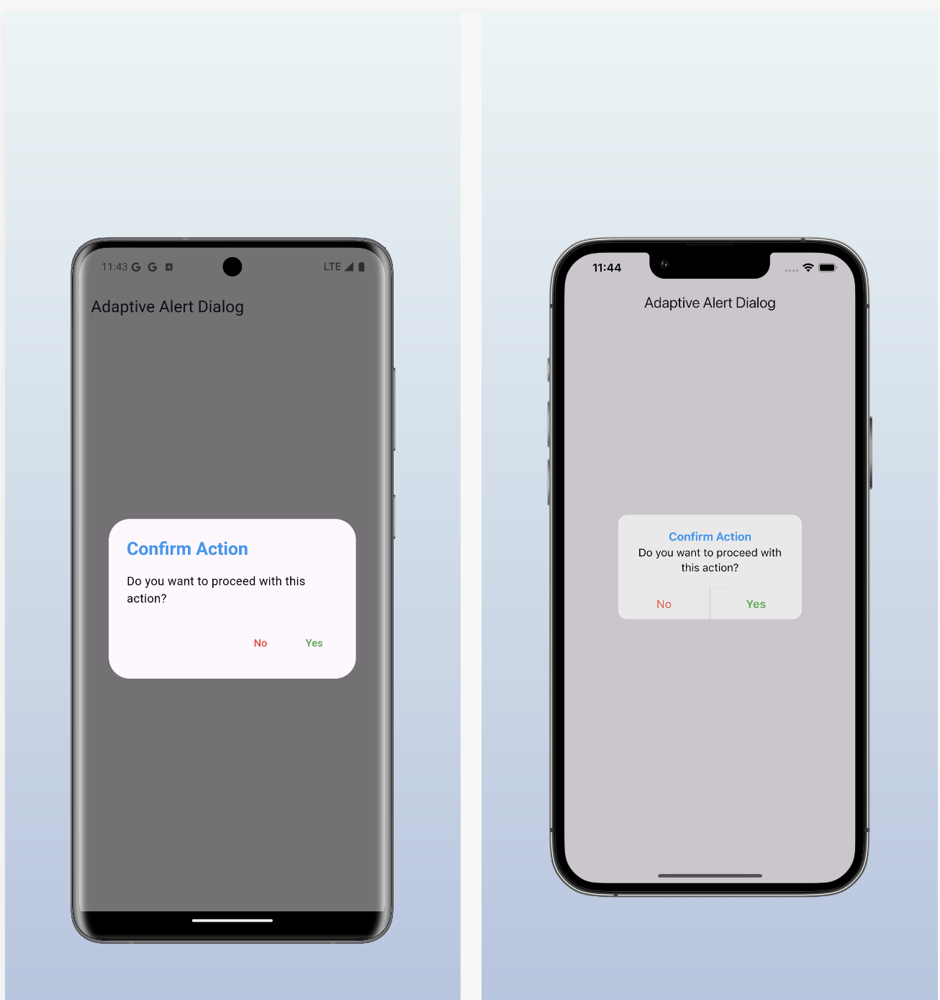

<!--
This README describes the package. If you publish this package to pub.dev,
this README's contents appear on the landing page for your package.

For information about how to write a good package README, see the guide for
[writing package pages](https://dart.dev/guides/libraries/writing-package-pages).

For general information about developing packages, see the Dart guide for
[creating packages](https://dart.dev/guides/libraries/create-library-packages)
and the Flutter guide for
[developing packages and plugins](https://flutter.dev/developing-packages).
-->

## Flutter Adaptive Dialog

A customizable alert dialog for Flutter that adapts to both Android and iOS platforms. This package allows developers to present alert dialogs with different styles for titles, content, and buttons.

## Created by [@badiniibrahim](https://github.com/badiniibrahim)

Liked some of my work? Buy me a coffee. Thanks for your support :heart:

<a href="https://buymeacoffee.com/toncopilote" target="_blank"></a>

## Screenshot




## Features

- Cross-platform support: Automatically adapts to iOS and Android styles.

- Customizable styles: Allows for custom text styles for title, content, and buttons.

- Simple API: Easy to integrate into any Flutter application.

## Getting started

Add the dependency to your `pubspec.yaml` file:

```yaml
dependencies:
  ...
    adaptive_alert_dialog: latest_version
```

## Here's a complete example showcasing the usage of the Flutter Adaptive Dialog:

```dart
void main() {
  runApp(MyApp());
}

class MyApp extends StatelessWidget {
  const MyApp({super.key});

  @override
  Widget build(BuildContext context) {
    return MaterialApp(
      debugShowCheckedModeBanner: false,
      title: 'Adaptive Alert Dialog Example',
      home: Scaffold(
        appBar: AppBar(
          title: const Text("Adaptive Alert Dialog"),
        ),
        body: Center(
          child: Builder(
            builder: (BuildContext context) {
              return ElevatedButton(
                onPressed: () async {
                  bool? result = await AdaptiveAlertDialog.show(
                    context: context,
                    title: "Confirm Action",
                    content: "Do you want to proceed with this action?",
                    confirmText: "Yes",
                    cancelText: "No",
                    titleStyle: const TextStyle(
                        fontWeight: FontWeight.bold, color: Colors.blue),
                    contentStyle:
                        const TextStyle(fontSize: 16, color: Colors.black),
                    confirmButtonStyle: const TextStyle(
                        color: Colors.green,
                        fontWeight: FontWeight.bold), // Style for Yes button
                    cancelButtonStyle: const TextStyle(
                        color: Colors.red), // Style for No button
                  );

                  if (result == true) {
                    print("User confirmed.");
                  } else {
                    print("User canceled.");
                  }
                },
                child: const Text("Show Dialog"),
              );
            },
          ),
        ),
      ),
    );
  }
}


```

### Parameters

- **`context`**: (required) The BuildContext to show the dialog.
- **`title`**: (required) The title of the dialog.
- **`content`**: (required) The content/message of the dialog.
- **`confirmText`**: (required) The text for the confirmation button.
- **`cancelText`**: (optional) The text for the cancellation button. If null, the cancel button will not be displayed.
- **`titleStyle`**: (optional) The style for the title text.
- **`contentStyle`**: (optional) The style for the content text.
- **`confirmButtonStyle`**: (optional) The style for the confirmation button text.
- **`cancelButtonStyle`**: (optional) The style for the cancellation button text.

## LinkedIn

Connect with me on [LinkedIn](https://www.linkedin.com/in/badini-ibrahim-sawadogo-306b119b/)
